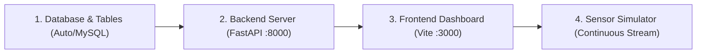

# I.S.A.A.C. — Evaluator Demo Runbook & Operations Guide
**Project:** I.S.A.A.C. (Industrial Systems Analytics & Asset Control)  
**Target Audience:** WebXcelerate Judges, Evaluators & Technical Operators  

---

## 1. Exact Startup Order

To ensure clean inter-service communication, start the services in the following order:



---

## 2. Exact Startup Commands

### Step 1: Backend ASGI Server (Terminal 1)
Open a terminal in the project root:

```powershell
# Optional: Set production/development environment variables
$env:PORT="8000"
$env:HOST="0.0.0.0"

# Start FastAPI backend with hot reload or production Uvicorn
python -m uvicorn backend.app.main:app --host 0.0.0.0 --port 8000 --reload
```
*Expected Output:*
```text
INFO:     Started server process
INFO:     Waiting for application startup.
INFO:     Connected to database: sqlite / mysql
INFO:     PredictiveMaintenanceInference loaded: XGBClassifier / RandomForestClassifier
INFO:     EventStreamManager initialized. Mode: LOCAL_FALLBACK (Kafka Enabled: False)
INFO:     Application startup complete.
INFO:     Uvicorn running on http://0.0.0.0:8000
```

### Step 2: Frontend Dashboard (Terminal 2)
Open a second terminal in the project root:

```powershell
cd frontend
npm run dev -- --port 3000 --host
```
*Expected Output:*
```text
  VITE v6.4.3  ready in 250 ms

  ➜  Local:   http://localhost:3000/
  ➜  Network: http://192.168.x.x:3000/
```

### Step 3: Health Probe Verification (Terminal 3 or Browser)
Verify that the services are healthy:
```powershell
curl http://localhost:8000/health/ready
```
*Expected Output:*
```json
{
  "status": "ready",
  "service": "I.S.A.A.C.",
  "database": {"status": "ok"},
  "ml_model": {"status": "loaded", "type": "RandomForestClassifier"},
  "kafka": {"enabled": false, "status": "degraded"}
}
```

---

## 3. Login Procedure

1. Open your browser and navigate to: **`http://localhost:3000`**
2. You will be greeted by the **ISAAC Industrial Access Gate**.
3. Select an Operator Profile from the dropdown:
   - **Dhananjay Sharma** — *Reliability Engineer* (`dhananjay.sharma@isaac-industrial.io`) — **Full Administrative & Maintenance Permissions**
   - **Abhishek Upadhyay** — *Plant Operator* (`abhishek.upadhyay@isaac-industrial.io`)
   - **Anu Sharma** — *Maintenance Lead* (`anu.sharma@isaac-industrial.io`)
4. Click **`Access Operations Console →`** to enter the live operations dashboard.

---

## 4. How to Start Sensor Simulation

### Method A: Via REST API (Quick Terminal Trigger)
To start streaming continuous telemetry for machine `M14860` under an overstrain degradation scenario:

```powershell
# Start Overstrain scenario at 1.5s tick interval
curl -X POST http://localhost:8000/api/simulator/start `
  -H "Content-Type: application/json" `
  -d '{\"machine_id\": \"M14860\", \"machine_type\": \"M\", \"scenario\": \"OVERSTRAIN_RAPID\", \"interval_seconds\": 1.5}'
```

### Method B: Via Standalone Stream Script (Terminal 3)
```powershell
python simulator/sensor_stream.py
```

### Checking Simulator Status
```powershell
curl http://localhost:8000/api/simulator/status
```

---

## 5. How to Demonstrate Live Prediction & Telemetry Stream

1. Navigate to the **`Operations Overview`** tab on the sidebar.
2. Observe the top header indicator: **`WS: CONNECTED`** (Green live pulse).
3. As simulator ticks are emitted:
   - The **Active Live Machine** card pulses with the current machine ID (`M14860`).
   - The **Real-Time Sensor Telemetry Chart** streams live Air/Process Temperatures, Torque, and Speed.
   - The **Live Fleet Health Risk Trend Chart** continuously updates the continuous Health Score (0–100) and ML Failure Probability (%).
   - The **Fleet Machine Registry Table** flashes the transmitting machine row in blue.
4. Click **`Inspect →`** on machine `M14860` to enter the **Machine Inspection View**:
   - View real-time gauge parameters.
   - Scroll down to the **"What-If Live Predictive Simulator"** panel.
   - Adjust the **Torque** slider to `65 Nm` and **Tool Wear** to `220 min`.
   - Click **`Run ML Inference Diagnostics`** to see instantaneous XGBoost failure probabilities and diagnostic risk factors.

---

## 6. How to Demonstrate Alert Generation

1. Start the **`HEAT_DISSIPATION_FAILURE`** scenario:
   ```powershell
   curl -X POST http://localhost:8000/api/simulator/start `
     -H "Content-Type: application/json" `
     -d '{\"machine_id\": \"L47180\", \"machine_type\": \"L\", \"scenario\": \"HEAT_DISSIPATION_FAILURE\", \"interval_seconds\": 1.0}'
   ```
2. In the web dashboard, observe:
   - A critical or warning alert appears immediately in the **Live Events Panel** on the Overview page.
   - The machine status changes from `OPERATIONAL` to `CRITICAL` (Red badge).
3. Navigate to the **`Anomaly Feeds`** tab on the sidebar:
   - View the active supervisory alert record with its timestamp and breach metrics.
   - Click **`Acknowledge Alert`**: State transitions from `OPEN` → `ACKNOWLEDGED`.
   - Click **`Resolve Alert`**: Enter resolution notes (e.g., *"Coolant pump cleared and flushed"*) to transition state to `RESOLVED`.

---

## 7. How to Create & Complete Maintenance Requests

1. Navigate to the **`Maintenance`** tab on the sidebar.
2. In the top section **"1. Predicted Maintenance Needs (Algorithm-Driven)"**:
   - Notice the machine needing maintenance flagged with `DUE` status based on active conditions and ML risk scores.
   - Click **`Create Work Order`** on the recommendation card.
3. A pre-filled modal appears with machine ID, issue description, and suggested action:
   - Assign to a technician (e.g., *"Technician Dave"*).
   - Click **`Confirm & Create Work Order`**.
4. Scroll to **"2. Confirmed Maintenance Orders"**:
   - Order appears under the **`Pending Orders`** list.
   - Click **`Start Work`** → status transitions to **`IN_PROGRESS`**.
   - Click **`Complete Work`** → enter action taken (e.g., *"Replaced tool inserts and calibrated spindle"*).
5. Upon completion:
   - The work order moves to **`Completed Orders`**.
   - Linked supervisory alerts are automatically marked **`RESOLVED`**.
   - Machine operational health is restored to **`OPERATIONAL`** (100% Health Score).

---

## 8. How to Demonstrate PySpark Big Data Processing

1. Open a terminal and run the PySpark analytics script:
   ```powershell
   python bigdata/spark_analytics.py
   ```
   *The pipeline ingests 10,000 sensor observations, cleans data, performs rolling window aggregations, and outputs summary statistics.*

2. Navigate to the **`Fleet Statistics`** (Analytics) tab on the web dashboard:
   - **Failure Analysis**: View machine failure rates partitioned by quality type (`L`, `M`, `H`).
   - **Sensor Correlations**: Examine rolling averages, standard deviations, and temperature margins.
   - **Machine Comparison**: Select multiple machines (`M14860`, `L47180`, `H39880`) to generate multi-dimensional radar comparison plots.

---

## 9. How to Inspect & Show the Machine Learning Model

1. Run the ML verification test script:
   ```powershell
   python -c "import joblib; m = joblib.load('ml/models/model.pkl'); p = joblib.load('ml/models/preprocessor.pkl'); print('Model Type:', type(m).__name__, '\nFeature Preprocessor:', type(p).__name__)"
   ```
2. Show the ML test suite passing 100%:
   ```powershell
   pytest backend/tests/test_ml_inference.py backend/tests/test_prediction_service.py -v
   ```

---

## 10. How to Safely Shut Down Services

When the demonstration is complete:

1. **Stop the Simulator**:
   ```powershell
   curl -X POST http://localhost:8000/api/simulator/stop
   ```
2. **Stop Frontend**: Press `Ctrl + C` in Terminal 2.
3. **Stop Backend**: Press `Ctrl + C` in Terminal 1.
4. Verify all background worker threads and database connections terminate cleanly.
