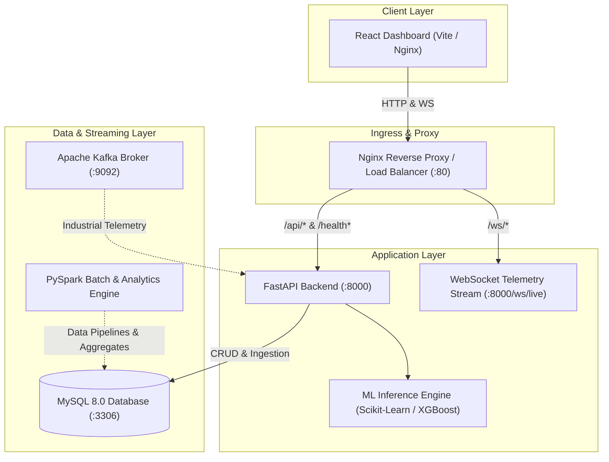

# I.S.A.A.C. Production Deployment & Operations Guide

This guide provides end-to-end instructions for deploying, configuring, operating, and monitoring **I.S.A.A.C.** (Intelligent System for Automated Analytics & Control) in production and staging environments.

---

## Table of Contents
1. [Architecture Overview](#1-architecture-overview)
2. [Prerequisites & System Requirements](#2-prerequisites--system-requirements)
3. [Environment Configuration Reference](#3-environment-configuration-reference)
4. [Database Setup & Migrations](#4-database-setup--migrations)
5. [Machine Learning Model Artifacts](#5-machine-learning-model-artifacts)
6. [PySpark Analytics Requirements](#6-pyspark-analytics-requirements)
7. [Apache Kafka Event Streaming Layer](#7-apache-kafka-event-streaming-layer)
8. [Backend Production Startup](#8-backend-production-startup)
9. [Frontend Production Build & Static Serving](#9-frontend-production-build--static-serving)
10. [Health Checks & Observability Probes](#10-health-checks--observability-probes)
11. [Local Production-Like Run Commands](#11-local-production-like-run-commands)
12. [Docker & Container Deployment](#12-docker--container-deployment)
13. [Security & Hardening Checklist](#13-security--hardening-checklist)

---

## 1. Architecture Overview



---

## 2. Prerequisites & System Requirements

### Hardware Sizing (Recommended Production Baseline)
- **CPU**: 4+ Cores (x86_64 or ARM64)
- **RAM**: 8 GB minimum (16 GB recommended for PySpark and Kafka workloads)
- **Disk**: 50 GB+ SSD storage (accounting for MySQL data and model storage)

### Software Dependencies
| Component | Supported Versions | Notes |
| :--- | :--- | :--- |
| **Python** | 3.10, 3.11, 3.12, 3.14 | Backend runtime & ML inference |
| **Node.js / npm** | Node 18+, Node 20 LTS | Frontend build environment |
| **MySQL Server** | 8.0+ | Relational persistence & operational storage |
| **Java JDK** | OpenJDK 8, 11, or 17 | Required only for PySpark transformations |
| **Apache Kafka** | 3.0+ / Confluent CP 7.5+ | Optional event broker (auto-fallback available) |
| **Docker & Compose** | Docker Engine 24+, Compose v2 | Optional containerized orchestration |

---

## 3. Environment Configuration Reference

ISAAC uses environment variables loaded via Pydantic `BaseSettings`. Copy `.env.production.example` to `.env` in the root workspace.

### Configuration Dictionary

| Variable Name | Type | Default Value | Production Recommendation | Description |
| :--- | :--- | :--- | :--- | :--- |
| `APP_NAME` | string | `I.S.A.A.C.` | `I.S.A.A.C.` | Name of the platform |
| `APP_ENV` | string | `development` | `production` | Active runtime environment (`production`, `staging`, `development`) |
| `DEBUG` | boolean | `True` | `False` | Disables debug stack traces in production API responses |
| `HOST` | string | `0.0.0.0` | `0.0.0.0` | Host interface for backend server binding |
| `PORT` | integer | `8000` | `8000` | Port for backend HTTP/WebSocket service |
| `DB_HOST` | string | `127.0.0.1` | `mysql-cluster.internal` | Hostname or IP of the MySQL instance |
| `DB_PORT` | integer | `3306` | `3306` | MySQL TCP listening port |
| `DB_USER` | string | `isaac_user` | `isaac_prod_user` | Dedicated unprivileged MySQL user |
| `DB_PASSWORD` | string | `isaac_password` | *Strong secret password* | MySQL user password (**Never commit**) |
| `DB_NAME` | string | `isaac_db` | `isaac_production` | Target MySQL database name |
| `JWT_SECRET_KEY` | string | *dev placeholder* | *32+ byte random hex string* | Secret key for signing JWT tokens |
| `JWT_ALGORITHM` | string | `HS256` | `HS256` | Cryptographic algorithm for JWT |
| `JWT_ACCESS_TOKEN_EXPIRE_MINUTES` | integer | `480` | `60` to `480` | Token expiration time in minutes |
| `CORS_ORIGINS` | string | `http://localhost:3000,...` | `https://isaac.company.com` | Comma-separated list of allowed browser origins |
| `KAFKA_BOOTSTRAP_SERVERS` | string | `localhost:9092` | `kafka-broker-1:9092,...` | Comma-separated Kafka broker addresses |
| `KAFKA_TOPIC_TELEMETRY` | string | `industrial_sensor_telemetry` | `industrial_sensor_telemetry` | Topic name for raw telemetry events |
| `KAFKA_CONSUMER_GROUP` | string | `isaac_prediction_group` | `isaac_prediction_group_prod` | Kafka consumer group identifier |
| `KAFKA_FALLBACK_TO_LOCAL` | boolean | `True` | `True` | Enable graceful fallback if Kafka broker is offline |
| `PREDICTIONS_STORE_SENSOR_HISTORY` | boolean | `True` | `True` | Automatically save sensor readings upon prediction |
| `VITE_API_BASE_URL` | string | `http://127.0.0.1:8000` | `https://isaac.company.com/api` | Base API URL injected during frontend build |
| `VITE_WS_BASE_URL` | string | `ws://127.0.0.1:8000` | `wss://isaac.company.com/ws` | Base WebSocket URL injected during frontend build |

---

## 4. Database Setup & Migrations

### 1. Provision MySQL Database and User
Log into MySQL as administrator and create the application database and user:

```sql
CREATE DATABASE IF NOT EXISTS isaac_db CHARACTER SET utf8mb4 COLLATE utf8mb4_unicode_ci;

CREATE USER IF NOT EXISTS 'isaac_user'@'%' IDENTIFIED BY 'your_strong_production_password';
GRANT ALL PRIVILEGES ON isaac_db.* TO 'isaac_user'@'%';
FLUSH PRIVILEGES;
```

### 2. Automatic Schema Creation
ISAAC initializes database tables automatically at application startup using SQLAlchemy metadata (`Base.metadata.create_all(bind=engine)` in `backend/app/database.py`).

### 3. Ingesting Baseline Dataset (Optional / First Run)
To seed the initial machine catalog and historical sensor baseline:

```bash
python scripts/ingest_data.py
```

---

## 5. Machine Learning Model Artifacts

ISAAC requires trained machine learning artifacts for predictive maintenance failure classification and risk assessment.

### Required Artifact Files
The following files must be located in `ml/models/`:
- `ml/models/model.pkl` — Trained Scikit-Learn / XGBoost Classifier.
- `ml/models/preprocessor.pkl` — Fitted column transformer / scaler.

### Verification of ML Artifacts
```bash
python -c "import joblib; m = joblib.load('ml/models/model.pkl'); p = joblib.load('ml/models/preprocessor.pkl'); print('Model:', type(m), 'Preprocessor:', type(p))"
```

### Model Feature Expectations
The inference engine expects the following sensor metrics:
- `air_temperature` (Kelvin or Celsius, normalized)
- `process_temperature` (Kelvin or Celsius, normalized)
- `rotational_speed` (RPM)
- `torque` (Nm)
- `tool_wear` (Minutes)
- `type` (`L`, `M`, or `H`)

---

## 6. PySpark Analytics Requirements

PySpark is utilized for scalable offline batch processing, feature extraction, and aggregate metric computation across large-scale historical sensor datasets.

### Prerequisites
1. **Java Development Kit (JDK)**: JDK 8, 11, or 17 must be installed and `JAVA_HOME` configured:
   ```bash
   java -version
   echo %JAVA_HOME%   # Windows
   echo $JAVA_HOME    # Linux / macOS
   ```
2. **PySpark Installation**:
   ```bash
   pip install pyspark>=3.5
   ```

### Executing Spark Analytics Pipeline
```bash
python bigdata/spark_analytics.py
```

---

## 7. Apache Kafka Event Streaming Layer

ISAAC provides an industrial event streaming layer for real-time sensor telemetry.

### Starting Kafka (Standalone / Docker)
If using Docker:
```bash
docker-compose up -d zookeeper kafka
```

### Topic Creation
```bash
kafka-topics.sh --create --topic industrial_sensor_telemetry --bootstrap-server localhost:9092 --partitions 3 --replication-factor 1
```

### Graceful Fallback Guarantee
If Kafka is unavailable or `KAFKA_FALLBACK_TO_LOCAL=True`, ISAAC automatically routes incoming telemetry through an asynchronous in-memory processor without failing incoming requests.

---

## 8. Backend Production Startup

### Running with Production ASGI Server (Uvicorn)

For high-throughput production deployment, run Uvicorn with multiple workers:

```bash
# Windows / Linux Production Run
python -m uvicorn backend.app.main:app --host 0.0.0.0 --port 8000 --workers 4 --log-level info --no-access-log
```

### Running with Gunicorn Process Manager (Linux)
On Linux servers, Gunicorn with Uvicorn worker classes is recommended:

```bash
gunicorn backend.app.main:app \
    --workers 4 \
    --worker-class uvicorn.workers.UvicornWorker \
    --bind 0.0.0.0:8000 \
    --timeout 120 \
    --access-logfile - \
    --error-logfile -
```

---

## 9. Frontend Production Build & Static Serving

### 1. Build Production Assets
In the `frontend/` directory:

```bash
cd frontend
npm ci
npm run build
```
This produces optimized production bundles in `frontend/dist/`.

### 2. Static Serving with Nginx
Point your Nginx server block to `frontend/dist/` (refer to [nginx.conf](file:///c:/Users/DELL/OneDrive/Desktop/I.S.A.A.C/nginx.conf)):

```nginx
server {
    listen 80;
    server_name isaac.company.com;
    root /usr/share/nginx/html;
    index index.html;

    location / {
        try_files $uri $uri/ /index.html;
    }

    location /api/ {
        proxy_pass http://127.0.0.1:8000/api/;
        proxy_set_header Host $host;
        proxy_set_header X-Real-IP $remote_addr;
        proxy_set_header X-Forwarded-For $proxy_add_x_forwarded_for;
        proxy_set_header X-Forwarded-Proto $scheme;
    }

    location /ws/ {
        proxy_pass http://127.0.0.1:8000/ws/;
        proxy_http_version 1.1;
        proxy_set_header Upgrade $http_upgrade;
        proxy_set_header Connection "upgrade";
        proxy_read_timeout 86400s;
    }
}
```

---

## 10. Health Checks & Observability Probes

ISAAC includes standard health and liveness/readiness probes:

| Endpoint | Method | Probe Type | Purpose | HTTP Status |
| :--- | :--- | :--- | :--- | :--- |
| `/health` | `GET` | Overall Health | Backward-compatible health status and component summary | `200 OK` |
| `/api/health` | `GET` | API Health | Namespace-compatible health endpoint | `200 OK` |
| `/health/live` | `GET` | **Liveness Probe** | Verifies process is alive and responsive (Kubernetes / ECS) | `200 OK` |
| `/health/ready` | `GET` | **Readiness Probe** | Verifies Database connectivity, ML model loading, and Kafka status | `200 OK` / `503 Service Unavailable` |

### Sample Readiness Response (`GET /health/ready`)
```json
{
  "status": "ready",
  "environment": "production",
  "timestamp": "2026-09-20T00:45:00.000Z",
  "checks": {
    "database": {
      "status": "healthy",
      "latency_ms": 2.15,
      "dialect": "mysql"
    },
    "ml_models": {
      "status": "healthy",
      "model_loaded": true,
      "preprocessor_loaded": true
    },
    "kafka": {
      "status": "healthy",
      "connected": true,
      "fallback_mode": false
    }
  }
}
```

---

## 11. Local Production-Like Run Commands

To run ISAAC locally in a production-identical setup without external cloud infrastructure:

### Terminal 1: Database Initialization
Ensure your local MySQL service is running on `127.0.0.1:3306`.

### Terminal 2: Production Backend
```powershell
# Set environment
$env:APP_ENV="production"
$env:DEBUG="False"
$env:PORT="8000"

# Launch Backend
python -m uvicorn backend.app.main:app --host 0.0.0.0 --port 8000 --workers 2
```

### Terminal 3: Build & Preview Frontend
```powershell
cd frontend
npm run build
npm run preview -- --port 3000 --host
```

### Terminal 4: Sensor Simulator
```powershell
python simulator/sensor_stream.py
```

---

## 12. Docker & Container Deployment

### Docker Files Reference
The repository includes container specifications:
- `Dockerfile.backend` — Multi-stage Python 3.11-slim container with non-root security user.
- `Dockerfile.frontend` — Multi-stage Node 20 build + Nginx Alpine runtime.
- `docker-compose.yml` — Orchestrates MySQL, Zookeeper, Kafka, Backend, and Frontend.
- `nginx.conf` — Reverse proxy and SPA routing definition.

### Launching with Docker Compose
```bash
docker-compose up --build -d
```

> [!NOTE]
> **Docker Host Environment Notice:**
> The Docker container definitions have been constructed according to standard multi-stage patterns. On developer hosts where the Docker CLI or Docker Desktop daemon is not installed, the application is fully operable and verified via direct local production commands (Uvicorn + Vite Preview + native MySQL/Kafka).

---

## 13. Security & Hardening Checklist

- [x] **No Secrets Committed**: `.env` and sensitive tokens are strictly ignored in `.gitignore` and `.dockerignore`.
- [x] **Password Hashing**: PBKDF2 with SHA-256 (600,000 rounds) used for all user credentials.
- [x] **Strict Input Validation**: Pydantic v2 schemas for all API payloads with bounded numeric limits.
- [x] **CORS Origins Controlled**: Wildcards disallowed in production environments.
- [x] **Safe Error Responses**: Detailed stack traces suppressed when `DEBUG=False`.
- [x] **Non-Root Container User**: Container runs under dedicated user `isaacuser` (UID 10001).
- [x] **Audit Logging**: Structured JSON logging with automated redaction of sensitive credentials.
