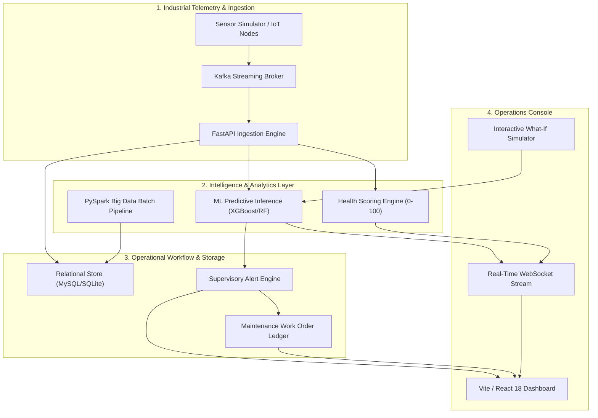

# I.S.A.A.C. — WebXcelerate Demonstration & Pitch Narrative
**Project Title:** I.S.A.A.C. — Industrial Systems Analytics & Asset Control  
**Event:** WebXcelerate Hackathon & Engineering Showcase  
**Target:** Technical Judges, Industrial Reliability Engineers & Enterprise Architects  

---

## 1. Executive Pitch & Value Proposition

> *"Unplanned industrial downtime costs manufacturing enterprises over $50 billion annually. Traditional supervisory control systems only react after physical damage has occurred, while standalone ML models often remain black boxes disconnected from maintenance workflows.*
>
> *I.S.A.A.C. bridges this gap by unifying real-time sensor telemetry, genuine machine learning inference, distributed PySpark Big Data analytics, Apache Kafka event streaming, and an end-to-end work order lifecycle into a single, observable, and resilient industrial operating system."*

---

## 2. Core Architectural Pillars

---

## 3. Five-Minute Live Demonstration Flow

### Act 1: The Operations Command Center (1 Minute)
1. **Show the Live Dashboard**:
   - Highlight the glassmorphism dark UI, responsive KPIs (Active Machines, Fleet Health Index, Critical Alerts, MTBF).
   - Point out the live **WebSocket Connection Indicator** (`WS: CONNECTED`) and the dynamic **"Last Updated"** ticker.
2. **Showcase Asset Quality Distribution**:
   - Show how the fleet is categorized into Low (`L`), Medium (`M`), and High (`H`) quality asset variants.

### Act 2: Real-Time Telemetry & Predictive Failure Ingestion (1.5 Minutes)
1. **Trigger an Overstrain / Thermal Degradation Scenario**:
   - Start the simulator: `curl -X POST http://localhost:8000/api/simulator/start -d '{"scenario": "OVERSTRAIN_RAPID"}'`.
2. **Watch the Real-Time Reaction**:
   - The transmitting machine row pulses blue in the fleet table.
   - Live sensor charts dynamically plot Air Temperature, Process Temperature, Torque, and RPM.
   - As tool wear and torque exceed threshold envelopes, the **ML Failure Probability** spikes to >90%, driving the **Health Score** down to <40%.
   - A critical supervisory alert is automatically emitted and broadcast via WebSocket to the live events panel.

### Act 3: Explainable Machine Diagnostics & "What-If" Analysis (1 Minute)
1. **Open Machine Inspection View**:
   - Drill into the degrading asset (`M14860`).
   - Review the multi-factor engineering risk breakdown (*"Overstrain Critical: Wear x Torque 12,500 min·Nm exceeds Type-M threshold"*).
2. **Interactive What-If Simulation**:
   - Adjust simulated physical parameters (e.g., lower torque to 35 Nm, reset tool wear).
   - Click **Run ML Inference Diagnostics** to instantly demonstrate risk remediation before touching physical machinery.

### Act 4: Maintenance Lifecycle & Health Restoration (1 Minute)
1. **Transition to the Maintenance Console**:
   - Demonstrate the clean separation of **Predicted Maintenance Needs** (algorithm recommendations) from **Confirmed Work Orders**.
   - Click **Create Work Order** from the predicted recommendation.
2. **Execute the Lifecycle**:
   - Move status: `PENDING` → `IN_PROGRESS` → `COMPLETED`.
   - Enter technician action notes (*"Replaced cutting inserts and recalibrated spindle"*).
3. **Observe Automated Closed-Loop Remediation**:
   - The linked alert is automatically marked `RESOLVED`.
   - The machine status returns to `OPERATIONAL` and the fleet health score is restored.

### Act 5: PySpark Big Data & Enterprise Scale (30 Seconds)
1. **Present the Analytics Tab**:
   - Show machine failure distributions computed directly via PySpark distributed aggregation across 10,000 observations.
   - Show multi-machine radar comparison matrices and rolling variance turbulence metrics.

---

## 4. Key Differentiators & Technical Innovations

| Capability | Legacy Industrial SCADA / Standalone Dashboards | I.S.A.A.C. Platform |
| :--- | :--- | :--- |
| **Prediction Engine** | Static threshold alarms with high false-positive rates | Multi-class XGBoost/RandomForest models with continuous probability estimation |
| **Explainability** | Black-box boolean indicators | Transparent physics-derived risk factors explaining *why* a machine is at risk |
| **Event Streaming** | Fragile point-to-point polling | Industrial Apache Kafka pub/sub with zero-downtime local in-memory fallback |
| **Big Data Integration** | SQL table locks on large history datasets | PySpark distributed sliding-window aggregations and feature engineering |
| **Operational Loop** | Disconnected alerts requiring external ticketing | Integrated Work Order lifecycle with auto-resolution and health restoration |
| **Deployment** | Vendor-locked proprietary hardware | Cloud-native Docker/Nginx containers & lightweight cross-platform ASGI execution |

---

## 5. Technology Stack Summary

- **Frontend**: React 18, Vite, Lucide React, ApexCharts / CSS Chart Envelopes, Vanilla CSS Design System.
- **Backend**: FastAPI (Python 3.11/3.14), Uvicorn ASGI, Pydantic v2 Settings & Validation Schemas.
- **Machine Learning**: Scikit-Learn, XGBoost, Joblib, Pandas, NumPy.
- **Big Data Engine**: Apache PySpark 3.5, Distributed SQL DataFrames, Sliding Window Functions.
- **Messaging & Streaming**: Apache Kafka (Confluent CP 7.5), Zookeeper, WebSockets (FastAPI / Native Client).
- **Database & Persistence**: SQLAlchemy 2.0 ORM, MySQL 8.0 / SQLite dual-dialect compatibility.
- **Testing & Quality Assurance**: Pytest (158 unit/integration tests), Vitest (11 frontend tests), End-to-End Operational Smoke Test.
- **DevOps & Containers**: Docker, Docker Compose, Nginx Reverse Proxy.
